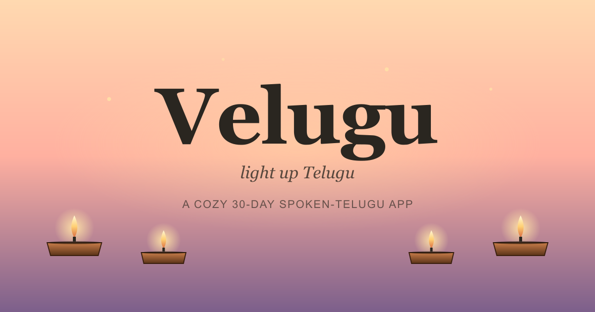

<div align="center">



# Velugu — light up Telugu

**A cozy 30-day spoken-Telugu app.** Hear, repeat, earn diyas.
No script required. No streak guilt. No tracking.

### 🪔 [Try it live →](https://m1r19.github.io/velugu/)

</div>

---

## What it is

Velugu is a calm, conversation-first way to start speaking Telugu. It's built for total beginners — partners marrying into Telugu families, NRIs reconnecting with their language, travellers, the merely curious. You're not learning the script. You're learning to talk.

The app is a small village you visit each day. Every phrase you learn lights one of its diyas.

## What's inside

- **30 days of conversational lessons** — English on the left, romanised Telugu on the right, audio one tap away. Script optional.
- **Three guide characters** — Anu (cheerful), Saraswati amma (gentle), Rohan (casual). Each greets you with absence-aware lines: warm if you're back after a day, patient if it's been a week.
- **Five branching scenario sims** — order chai, bargain at a market, take an auto, meet a grandparent, ask directions. Real choices, real Telugu, real cultural notes.
- **Live translator** — tap the mic and a Telugu friend's phrase becomes English in seconds. Or type phonetically and the app fuzzy-matches against its phrase database.
- **Practice modes** — Flashcards, Listen & Pick, Say It (with mic-graded pronunciation), Match Pairs, Daily Review, Weak Spots. Powered by SM-2 spaced repetition.
- **Soft systems** — variable-reward surprise envelopes (proverbs, Tollywood quotes, cultural notes), streak freezes that auto-protect missed days, mood-aware sessions, opt-in gentle reminders.
- **Installable** — PWA, works offline after first visit, lives on your home screen.

## Highlights

| | |
|---|---|
| 🪔 Cozy village home | A sky that shifts with the time of day, fireflies that drift more at dusk, diyas that glow when lit. |
| 🎙️ Real mic grading | Speak a phrase, get scored on pronunciation similarity (Web Speech API). |
| ✨ Surprise envelopes | ~1-in-3 sessions drops a hand-written reward: a Telugu proverb, a Tollywood line, a cultural fact. |
| 🎯 Spaced repetition | Phrases you struggle with come back tomorrow; phrases you nail wait a week. |
| 🔒 Local-only by default | No account, no server, no analytics. Everything stays on your device. |

## Run locally

The app is a static site — no build step.

```bash
git clone https://github.com/M1R19/velugu.git
cd velugu
python -m http.server 8000
# then open http://localhost:8000/
```

You need a local server (not `file://`) for the microphone-based features to work; `python -m http.server` is the simplest. `npx serve` works too.

## Built with

Pure HTML, CSS, and vanilla JavaScript. No framework. No bundler. No backend.

- **PWA** — installable, offline-capable via service worker
- **Web Speech API** — TTS + speech recognition, native to the browser
- **MyMemory** — free public translation API for the live translator (opt-in usage only)
- **Fraunces** + **Inter** + **Noto Serif Telugu** — typography
- **Lucide-style icon set** — inline SVGs
- **GitHub Pages** — hosting

## Privacy

We don't run analytics, telemetry, ads, or any third-party tracking. The app stores your progress (completed days, streak, settings, SRS schedule, favourites) **only in your browser's localStorage**, never on a server. There is no signup and no account. Clearing your browser data or uninstalling the app deletes everything permanently.

The translator is the one feature that makes a network call (to MyMemory's free public API) — only when you actively tap Translate, and only with the text you typed. Full details at [privacy.html](./privacy.html).

## Status

**Live and usable today.** Submitted to nobody yet. If you'd like to test on Android, the Play Store package is generated and ready to upload (`Velugu.aab`); see [store-listing.txt](./store-listing.txt) for the listing copy.

## Roadmap

- [ ] Native audio recordings (replacing TTS for the core phrases)
- [ ] Google Play Store submission
- [ ] iOS app via Capacitor when there's demand
- [ ] AI-powered character chat (LLM-backed) when a backend exists
- [ ] More scenarios, expanded into 60-day curriculum
- [ ] Optional Sunday postcards (shareable weekly summaries)

## License

MIT. Use it, fork it, learn from it.

---

<div align="center">
<sub>Built with warmth · <a href="https://m1r19.github.io/velugu/">try it live</a></sub>
</div>
